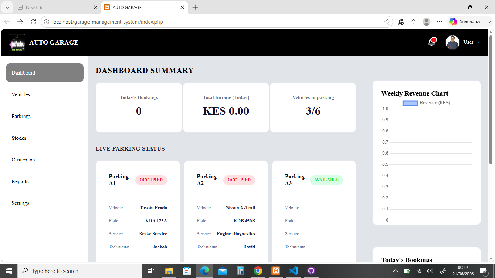

# Garage Management System

Version: v0.3 Beta

Status: 🚧 Active Development

A modern web-based Garage Management System developed using PHP, MySQL, CSS, and JavaScript.

---

## System Overview

The system is designed to streamline garage and workshop operations including vehicle registration, service management, customer tracking, parking allocation, inventory control, billing, and reporting.

---

## Screenshots

### Dashboard

### Vehicle Management

---

## Features

- Vehicle Registration
- Customer Management
- Service Booking
- Workshop Operations
- Payment Tracking
- Dashboard Analytics
- Parking Management
- Staff Management

---

## Technologies

- PHP
- MySQL
- JavaScript
- CSS

---

## Future Enhancements

- Job Cards
- Inventory Management
- Billing & Invoicing
- Service History Tracking
- Reports & Analytics

---

## Installation

1. Clone repository
2. Import MySQL database
3. Configure database.php
4. Run project using XAMPP

---

## Author

Brian Otieno

GitHub:
https://github.com/Briana-dot
